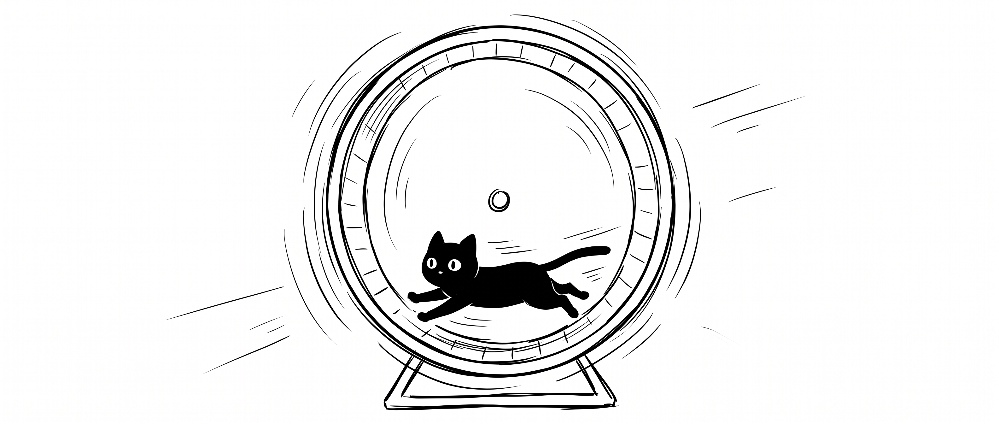

# Awesome Loop Engineering

[English](README.md) | **中文**

精选的 Loop Engineering 资源列表——关于构建、运行和规模化自主 AI Agent 循环的工程实践。

## 目录

- [文章 \& 博客](#文章--博客)
- [开源项目](#开源项目)
- [研究 \& 论文](#研究--论文)
- [演讲 \& 视频](#演讲--视频)

## 文章 & 博客

关于 Agent Loop 设计、Harness 工程和自主执行模式的博客文章与深度解析。

[Loop Engineering](https://addyosmani.com/blog/loop-engineering/) - 对 Loop Engineering 这一新兴学科的全面介绍：设计、构建和运行自主 AI Agent 循环。作者 @addyosmani。  
[WTF Is a Loop? Peter Steinberger vs. Boris Cherny](https://x.com/mvanhorn/status/2063865685558903149) - 两位真正构建过生产级 AI Agent Loop 的工程师的对谈，讲清楚 Loop 到底是什么、为什么重要。作者 @mvanhorn。  
[WTF Is a Loop? Part 2: The 15 Loops People Are Actually Running](https://x.com/mvanhorn/article/2068426104088748331) - 15 个正在生产中运行的 Agent Loop 实例目录，附可直接复用的命令。作者 @mvanhorn。  
[Loop Engineering](https://x.com/addyosmani/status/2064127981161959567) - Addy Osmani 对 Loop Engineering 作为一门新学科的阐述，包含自主 Agent Loop 的实践案例。作者 @addyosmani。  
[Loops Explained: Claude, GPT, Mira and What Actually Works](https://x.com/AnatoliKopadze/status/2068328135611822149) - 对比不同 AI 编程工具的 Agent Loop 实现，分析哪些方法真正有效。作者 @AnatoliKopadze。  
[Loop Engineering: The 14-Step Roadmap from Prompter to Loop Designer](https://x.com/0xCodez/status/2064374643729773029) - 从基础提示词到设计自主 Agent Loop 的 14 步进阶路线图。作者 @0xCodez。  
[Loops: What Every AI Engineer Needs to Know in 2026](https://x.com/sairahul1/status/2064277888216555684) - 为什么 Loop 正成为 AI 工程师的必备知识，以及当前的技术格局。作者 @sairahul1。  
[用好 Loop 能让你事半功倍，六个实战场景教你驾驭循环工程](https://x.com/KyrieCheungYep/status/2070333819249627273) - 六个真实 Loop Engineering 场景与实战技巧。作者 @KyrieCheungYep。  
[Loop Engineering 从 0 到 1 小白完整教程](https://x.com/AdrianPunk115/status/2068947825120223659) - 从零基础到构建第一个自主 Loop 的完整教程。作者 @AdrianPunk115。

## 开源项目

构建自主 Agent Loop 的框架、库与工具。

[loopy](https://github.com/Forward-Future/loopy) - 构建和运行自主 AI Agent Loop 的框架。作者 @Forward-Future。  
[Loops](https://loops.elorm.xyz/) - 编程 Agent 的闭环工作流集合，每个 Loop 包含触发器、反馈门和退出条件，Agent 自行推进直到任务完成。

## 研究 & 论文

关于 Agent 架构、自主执行和 Loop 设计的学术与工业研究。

<!-- 格式：
[论文标题](URL) - 一句话描述。作者 @author。
-->

## 演讲 & 视频

关于构建和运行 AI Agent Loop 的会议演讲、教程与对话。

[WTF Is an "AI Agent Loop"? Genius or Hype?](https://www.youtube.com/watch?v=7clJ8IH784Q) - 视频解析 AI Agent Loop 到底是什么，区分真正的工程实践与 buzzword。

## 参与贡献

欢迎贡献！提交 Pull Request 前请先阅读[贡献指南](CONTRIBUTING.md)。

## 许可证

[MIT](LICENSE) © [@builderpeng](https://x.com/builderpeng)
